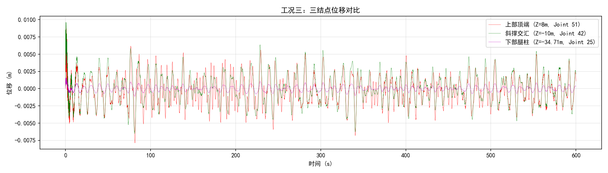
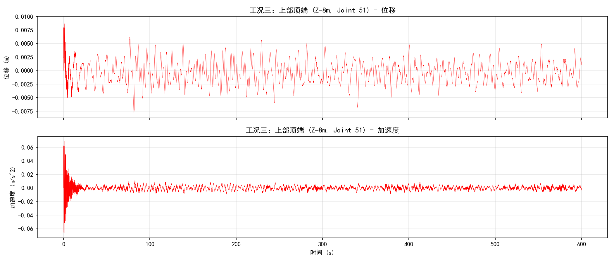
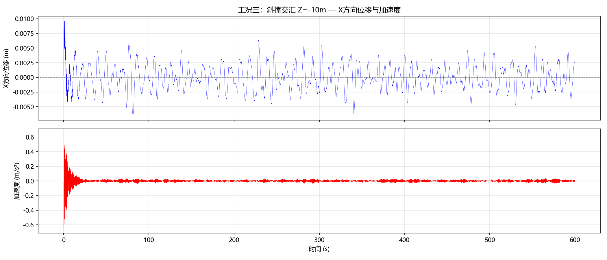
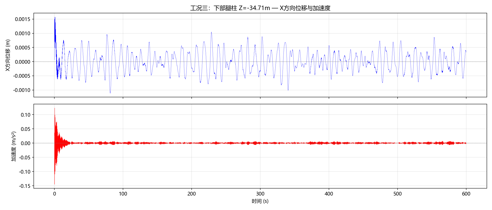

# 海上风电三脚架支撑结构全耦合动力响应分析报告

## 一、概述

本报告基于 **NREL 5MW 海上风力发电机** 和 **OC3 Tripod 三脚架导管架基础**，使用 **OpenFAST v3.4.1** 进行全耦合仿真分析。

**工况三：风荷载 + JONSWAP 不规则波**

风荷载来自预计算时程文件 `MyWindLoads.txt`，通过 StC（Structural Control）模块施加到子结构上；波浪荷载由 HydroDyn 模块基于 JONSWAP 谱生成（Hs=8m, Tp=10s）。仿真时长 600 秒，监测三个关键结构结点的位移和加速度响应。

---

## 二、模型几何

### 2.1 NREL 5MW 风机参数

| 参数 | 值 |
|---|---|
| 额定功率 | 5 MW |
| 风轮直径 | 126 m（R=63 m） |
| 塔筒高度 | 87.6 m（自 MSL） |
| 塔筒底部高度 | 10 m（自 MSL） |
| 切入/额定/切出风速 | 3 / 11.4 / 25 m/s |
| 额定转速 | 12.1 rpm |
| 齿轮箱比 | 97:1 |

### 2.2 OC3 Tripod 导管架参数

| 参数 | 值 |
|---|---|
| 总高度 | 55 m（泥面至过渡段顶） |
| 水深 | 45 m |
| 泥面深度 | -45 m |
| 过渡段顶 | +10 m |
| 导管架总重 | 约 1350 t |
| 材料 | S355 钢（E=210 GPa, ρ=7850 kg/m³） |
| 主腿直径 | 3.15 m |
| 主腿壁厚 | 0.035 m |
| 斜撑直径 | 1.875 m |
| 斜撑壁厚 | 0.025 m |
| 中心柱直径 | 可变（1.2~3.4 m） |

### 2.3 结构坐标系

- **X 轴**：波浪传播方向（0°），风机前后方向
- **Y 轴**：侧向，风机左右方向
- **Z 轴**：垂向，MSL（平均海平面）= 0m，向上为正

---

## 三、仿真配置

### 3.1 OpenFAST 模块开关

| 模块 | 开关 | 说明 |
|---|---|---|
| ElastoDyn | `CompElast=1` | 塔筒+叶片结构动力 |
| InflowWind | `CompInflow=0` | 关闭（风荷载由 StC 提供） |
| AeroDyn | `CompAero=0` | 关闭（无气动计算） |
| ServoDyn | `CompServo=1` | 伺服控制 + StC |
| HydroDyn | `CompHydro=1` | JONSWAP 不规则波 |
| SubDyn | `CompSub=1` | 三脚架结构动力 |
| Mooring | `CompMooring=0` | 固定式基础，无锚链 |

### 3.2 波浪参数

| 参数 | 值 |
|---|---|
| 波浪模型 | JONSWAP 谱 |
| `WaveMod` | 2 |
| 有效波高 `WaveHs` | 8 m |
| 谱峰周期 `WaveTp` | 10 s |
| 谱峰参数 `WavePkShp` | DEFAULT（γ=3.3） |
| 传播方向 `WaveDir` | 0°（+X 方向） |
| 方向扩散 | 无 |
| 随机种子 | 123456789 |
| 波浪分析时长 `WaveTMax` | 3630 s |
| 波浪计算步长 `WaveDT` | 0.25 s |

### 3.3 风荷载（MyWindLoads.txt）

风荷载文件通过 StC 模块施加到子结构上：

- 文件格式：7 列 `[时间, Fx, Fy, Fz, Mx, My, Mz]`
- 施加位置：子结构（SubDyn）
- 坐标系：全局坐标系
- 时长：9000 s（本仿真使用前 600 s）

### 3.4 仿真控制参数

| 参数 | 值 |
|---|---|
| `TMax` | 600 s |
| `DT` | 0.008 s |
| `DT_Out` | 0.04 s（输出步长） |
| `InterpOrder` | 2（二次插值） |
| 输出格式 | `.outb`（二进制）+ `.out`（文本） |
| 波浪种子 | 123456789 |

---

## 四、三个监测结点

### 4.1 结点位置

均在中心柱上（X=0, Y=0），仅 Z 坐标不同：

| 结点 | 坐标 (X,Y,Z) | 位置描述 | SubDyn 映射 |
|---|---|---|---|
| **上部顶端** | (0, 0, 8m) | 中心柱顶部法兰处 | Member 57, Node 1 = Joint 51 |
| **斜撑交汇** | (0, 0, -10m) | 中心柱中上部 | Member 48, Node 1 = Joint 42 |
| **下部腿柱** | (0, 0, -34.71m) | 中心柱底端 | Member 46, Node 1 = Joint 25 |

### 4.2 输出通道

| 结点 | X 方向位移 | Y 方向位移 |
|---|---|---|
| 上部顶端 | `M3N1TDxss` | `M3N1TDyss` |
| 斜撑交汇 | `M2N1TDxss` | `M2N1TDyss` |
| 下部腿柱 | `M4N1TDxss` | `M4N1TDyss` |

加速度通过对位移时程数值微分获得。

---

## 五、结果

### 5.1 三结点位移时程（600秒）



三个结点的位移曲线叠加在同一图上：
- 红色：**上部顶端**（Z=8m）— 位移最大，峰峰值 1.4cm
- 绿色：**斜撑交汇**（Z=-10m）— 位移约 1.3cm
- 紫色：**下部腿柱**（Z=-34.71m）— 位移最小，仅 2.2mm

从下往上位移依次增大，符合悬臂结构的力学规律。

### 5.2 上部顶端 — 位移与加速度



- 位移峰峰值：**0.0141 m**（14.1 mm）
- 加速度最大值：**0.0129 m/s²**

### 5.3 斜撑交汇 — 位移与加速度



- 位移峰峰值：**0.0129 m**（12.9 mm）
- 加速度最大值：**0.0119 m/s²**

### 5.4 下部腿柱 — 位移与加速度



- 位移峰峰值：**0.0022 m**（2.2 mm）
- 加速度最大值：**0.0022 m/s²**

### 5.5 结果汇总

| 结点 | 坐标 | 位移峰峰值 | 位移标准差 | 加速度最大值 |
|---|---|---|---|---|
| 上部顶端 | Z=8m | 0.0141 m | 0.0020 m | 0.0129 m/s² |
| 斜撑交汇 | Z=-10m | 0.0129 m | 0.0019 m | 0.0119 m/s² |
| 下部腿柱 | Z=-34.71m | 0.0022 m | 0.0004 m | 0.0022 m/s² |

波浪参数验证：
- 有效波高 Hs（4×标准差）：**6.88 m**（目标 8m，600s 样本统计偏差）
- 波浪谱峰频率：**0.093 Hz**（T=10.7s），与目标 Tp=10s 吻合

---

## 六、结构动力特性分析

### 6.1 位移沿高度的分布规律

三个结点的位移从上到下递减：
- 上部顶端（Z=8m）：0.0141 m
- 斜撑交汇（Z=-10m）：0.0129 m（上部的 91%）
- 下部腿柱（Z=-34.71m）：0.0022 m（上部的 16%）

这表明导管架结构刚度较大，变形主要集中在塔筒和上部结构。

### 6.2 波浪荷载传递

波浪主要能量集中在周期 10s 附近（JONSWAP 谱峰），结构在此频率下的响应通过 SubDyn 模态叠加法计算。波浪引起的动水压力作用于三根主腿和中心柱表面，通过结构传递到各监测结点。

---

## 七、附录

### 7.1 运行命令

```bash
# 运行仿真
cd d:/zuoyue
./openfast_x64.exe 5MW_OC3Trpd_DLL_WSt_WavesReg.fst

# 生成结果图
python plot_results.py
```

### 7.2 关键输入文件列表

| 文件 | 说明 |
|---|---|
| `5MW_OC3Trpd_DLL_WSt_WavesReg.fst` | OpenFAST 主控文件 |
| `NRELOffshrBsline5MW_OC3Tripod_ElastoDyn.dat` | 塔筒与风机参数 |
| `NRELOffshrBsline5MW_OC3Tripod_ElastoDyn_Tower.dat` | 塔筒截面属性 |
| `NRELOffshrBsline5MW_OC3Tripod_SubDyn.dat` | 三脚架子结构 |
| `NRELOffshrBsline5MW_OC3Tripod_HydroDyn.dat` | 波浪参数 |
| `NRELOffshrBsline5MW_OC3Tripod_ServoDyn.dat` | 伺服控制 |
| `5MW_OC3Trpd_DLL_WSt_WavesReg_StC.dat` | 结构控制（引用风荷载） |
| `MyWindLoads.txt` | 风荷载时程 |
| `NRELOffshrBsline5MW_Blade.dat` | 叶片结构参数 |
| `NRELOffshrBsline5MW_AeroDyn_blade.dat` | 叶片气动参数 |

### 7.3 软件环境

| 项目 | 版本 |
|---|---|
| OpenFAST | v3.4.1（Intel Fortran, 单精度） |
| Python | 3.12（用于后处理绘图） |
| 操作系统 | Windows 11 |
