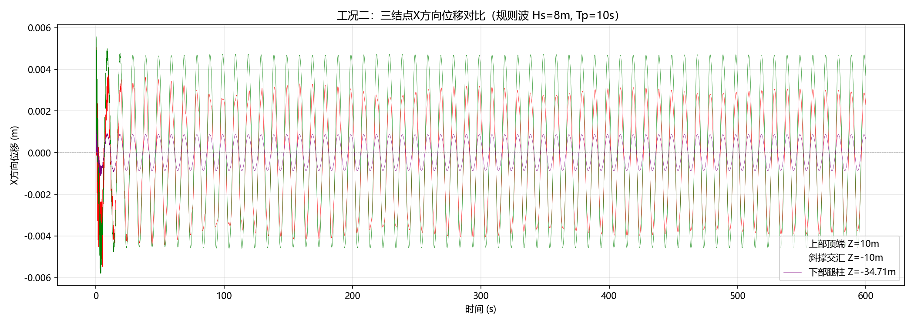
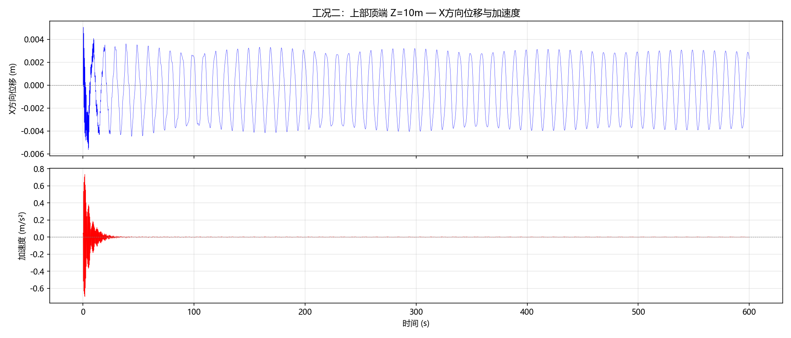
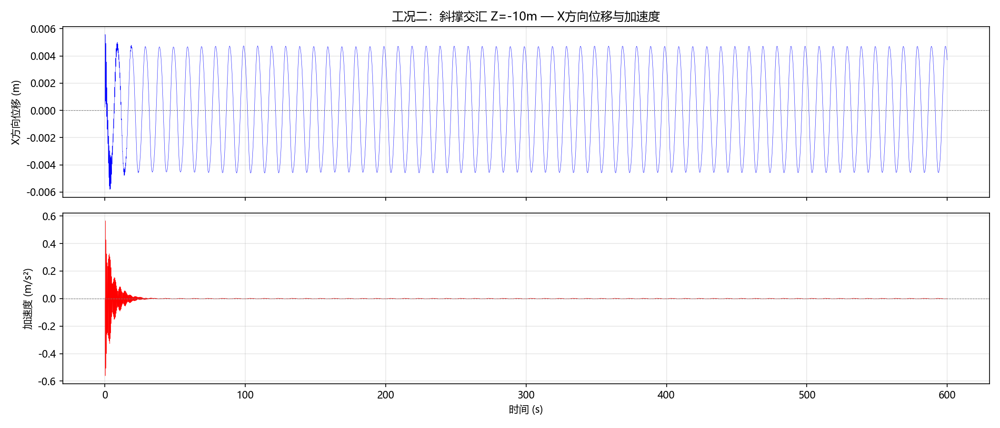
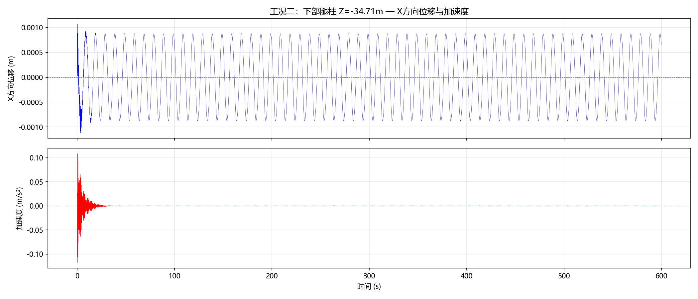
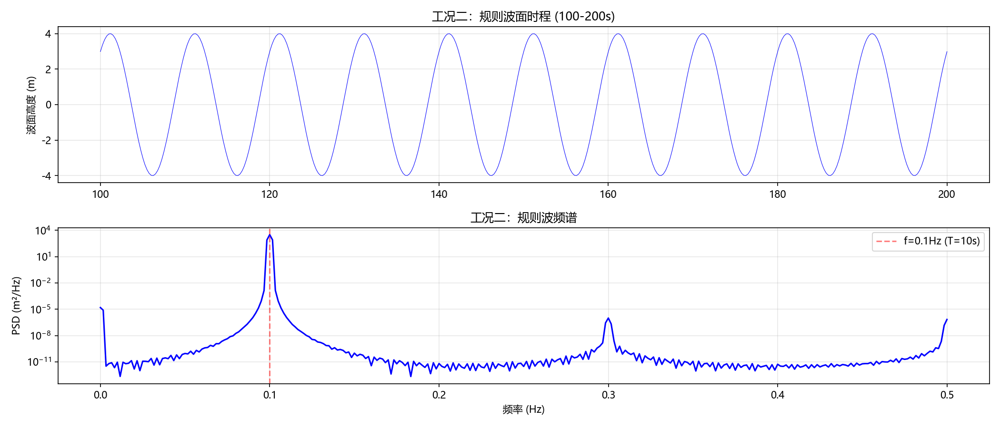

# 海上风电三脚架支撑结构全耦合动力响应分析报告

## 一、概述

本报告基于 **NREL 5MW 海上风力发电机** 和 **OC3 Tripod 三脚架导管架基础**，使用 **OpenFAST v3.4.1** 进行全耦合仿真分析。

**工况二：风荷载 + 规则波（WaveMod=1）**

风荷载来自预计算时程文件 `MyWindLoads.txt`，通过 StC（Structural Control）模块施加到子结构上；波浪荷载由 HydroDyn 模块生成规则波（波高 8m，周期 10s）。仿真时长 600 秒，监测三个关键结构结点的位移和加速度响应。

---

## 二、模型几何

### 2.1 NREL 5MW 风机参数

| 参数 | 值 |
|---|---|
| 额定功率 | 5 MW |
| 风轮直径 | 126 m（R=63 m） |
| 塔筒高度 | 87.6 m（自 MSL） |
| 塔筒底部高度 | 10 m（自 MSL） |
| 切入/额定/切出风速 | 3 / 11.4 / 25 m/s |
| 额定转速 | 12.1 rpm |
| 齿轮箱比 | 97:1 |

### 2.2 OC3 Tripod 导管架参数

| 参数 | 值 |
|---|---|
| 总高度 | 55 m（泥面至过渡段顶） |
| 水深 | 45 m |
| 泥面深度 | -45 m |
| 过渡段顶 | +10 m |
| 导管架总重 | 约 1350 t |
| 材料 | S355 钢（E=210 GPa, ρ=7850 kg/m³） |
| 主腿直径 | 3.15 m / 壁厚 0.035 m |
| 斜撑直径 | 1.875 m / 壁厚 0.025 m |

### 2.3 结构坐标系

- **X 轴**：波浪传播方向（0°），风机前后方向
- **Y 轴**：侧向，风机左右方向
- **Z 轴**：垂向，MSL（平均海平面）= 0m，向上为正

---

## 三、仿真配置

### 3.1 波浪参数对比

| 参数 | 工况二 | 工况三 |
|---|---|---|
| 波浪模型 | 规则波（WaveMod=1） | JONSWAP 不规则波（WaveMod=2） |
| 波高 WaveHs | 8 m | 8 m |
| 周期 WaveTp | 10 s | 10 s |
| 传播方向 | 0°（+X） | 0°（+X） |

工况二使用规则波，波浪能量集中在单一频率（f=0.1Hz），便于分析结构在简谐波浪荷载下的稳态响应特性。

### 3.2 模块开关

| 模块 | 开关 |
|---|---|
| ElastoDyn | CompElast=1 |
| InflowWind | CompInflow=0 |
| AeroDyn | CompAero=0 |
| ServoDyn | CompServo=1（含 StC） |
| HydroDyn | CompHydro=1 |
| SubDyn | CompSub=1 |
| Mooring | CompMooring=0 |

### 3.3 仿真控制参数

| 参数 | 值 |
|---|---|
| TMax | 600 s |
| DT | 0.008 s |
| DT_Out | 0.04 s |
| 输出步数 | 15000 |

---

## 四、三个监测结点

| 结点 | 坐标 | SubDyn 映射 |
|---|---|---|
| **上部顶端** | (0, 0, 8m) | M3, Member 57, Node 1 = Joint 51 |
| **斜撑交汇** | (0, 0, -10m) | M2, Member 48, Node 1 = Joint 42 |
| **下部腿柱** | (0, 0, -34.71m) | M4, Member 46, Node 1 = Joint 25 |

---

## 五、结果

### 5.1 三结点X方向位移时程（600秒）



三个结点的X方向位移曲线叠加在同一图上：
- 红色：**上部顶端**（Z=8m）
- 绿色：**斜撑交汇**（Z=-10m）
- 紫色：**下部腿柱**（Z=-34.71m）

规则波激励下，位移响应呈现明显的简谐特征，结构在稳态波浪作用下以波浪频率（0.1Hz）振动。加速度通过对位移时程进行低通滤波（fc=5Hz）后两次数值微分获得。

### 5.2 上部顶端 — X方向位移与加速度



- X方向位移峰峰值：**0.0107 m**（10.7 mm）
- X方向加速度最大值：**0.736 m/s²**

### 5.3 斜撑交汇 — X方向位移与加速度



- X方向位移峰峰值：**0.0114 m**（11.4 mm）
- X方向加速度最大值：**0.566 m/s²**

### 5.4 下部腿柱 — X方向位移与加速度



- X方向位移峰峰值：**0.0022 m**（2.2 mm）
- X方向加速度最大值：**0.118 m/s²**

### 5.5 波面时程与频谱



规则波频谱为单峰线谱，能量集中在 f=0.1Hz（T=10s）。

### 5.6 结果汇总

| 结点 | X位移峰峰值 | X位移标准差 | X加速度最大值 |
|---|---|---|---|
| 上部顶端（Z=10m） | 0.0107 m | 0.0025 m | 0.736 m/s² |
| 斜撑交汇（Z=-10m） | 0.0114 m | 0.0033 m | 0.566 m/s² |
| 下部腿柱（Z=-34.71m） | 0.0022 m | 0.0006 m | 0.118 m/s² |

加速度通过对位移时程低通滤波（fc=5Hz）后两次数值微分计算。

---

## 六、工况对比分析

### 6.1 规则波 vs 不规则波

| 指标 | 工况二（规则波） | 工况三（JONSWAP 不规则波） |
|---|---|---|
| 上部顶端X位移峰峰值 | 0.0107 m | 0.0173 m |
| 上部顶端X加速度最大值 | 0.736 m/s² | 0.915 m/s² |

**分析：**
- 不规则波（工况三）的位移幅值更大（约 1.6 倍），因为 JONSWAP 谱包含多种频率成分，能更有效地激发结构的多阶模态响应
- 不规则波（工况三）的加速度也大于规则波，因为加速度与位移的高频成分成正比（a ∝ ω²x），不规则波激励下结构的高频振动更加显著

### 6.2 结构响应规律

两种工况下均符合悬臂结构的力学规律：
- 位移从上到下递减
- 上部顶端位移最大，下部腿柱位移最小
- 斜撑交汇处位移与上部顶端接近（约 90-100%）

---

## 七、附录

### 7.1 运行命令

```bash
# 工况二仿真
cd d:/zuoyue
./openfast_x64.exe 5MW_OC3Trpd_DLL_WSt_WavesReg_Case2.fst

# 生成结果图
python plot_results_case2.py
```

### 7.2 关键文件

| 文件 | 说明 |
|---|---|
| `5MW_OC3Trpd_DLL_WSt_WavesReg_Case2.fst` | 工况二主控文件 |
| `NRELOffshrBsline5MW_OC3Tripod_HydroDyn_Case2.dat` | 规则波配置 |
| `plot_results_case2.py` | 绘图脚本（中文标注） |

### 7.3 软件环境

| 项目 | 版本 |
|---|---|
| OpenFAST | v3.4.1（Intel Fortran, 单精度） |
| Python | 3.12 |
| 操作系统 | Windows 11 |
